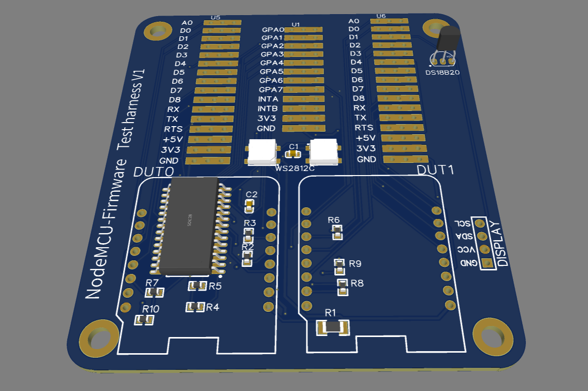

Hardware Test Harness
=====================

There is an implementation of the hardware testing design which is a small 4in x 4in board with positions for
two Wemos D! Mini ESP8266 boards, a breadboard area and a number of positions for peripherals. A rendering of the board is below and the [schematics](Test-harness-schematic-v1.pdf)
are available as well: . 

The test harness runs from a dedicated host computer, which is expected
to have reset- and programming-capable UART links to both ESP8266
devices, as found on almost all ESP8266 boards with USB to UART
adapters, but the host does not necessarily need to use USB to connect,
so long as TXD, RXD, DTR, and RTS are wired across.

The alternate pins on the primary D1 Mini (DUT0) are cross wired to the
RX and TX pins on the secondary D1 Mini (DUT1) and these are enabled by
a pin on the MCP23017.

Build Notes
-----------

The only thing that needs to be done is to solder on 0.1" headers at the required
positions. Typically D1 Minis come with 2 sets of 8 pin headers, both male and female.
I solder the female headers to the board, and the maie headers to the D1 minis. Other,
mostly 4 pin, headers can be soldered at the other positions. The 7 pin header for
the color sensor (TCS34725) requires some care as the board needs to be mounted
upside down so that the sensor is directly above the WS2812. 

The screw holes at the corners are for M3 screws. A standard adhesive rubber foot can
also be used. There are no components on the underside of the test board, so not much clearance
is required (only the length of the various headers soldered on the board).

Power
-----

The board is powered by either (or both) D1 Mini USB connection. Given the cross connects
between the two D1 Minis, I think that all the tests can be conducted from DUT0, but
it is probably easier to connected both of the D1 Minis via USB to the test runner.

There is a small resistor between the two 5 volt rails to prevent large currents
if the two USB feeds are at slughtly different voltages. The 3.3 volt rails are
directly connected together. If the regulators produce slightly different voltages,
then the one producing the higher voltage will end up providing all the power for the
3.3 volt devices.

Peripherals
-----------

### I2C Bus

Most of the positions on the board are connected to the DUT1 I2C bus.

#### MCP23017: I/O Expander (DUT 0, 0x20)

As per the [Generic Framework](README.md).

### WS2812s

There are three WS2812s connected on DUT1/D4. The last Ws2812 is positioned so that a TCS34725 module
can be mounted upside down over it to read out the color of the WS2812. That device is connected to
the I2C port on DUT0. A suitable board is [CJMCU-34725 TCS34725 Color Sensor RGB color sensor development board module](https://www.aliexpress.com/item/32412698433.html). The illuminating
LED is connected to the INT pin and so you can disable the LED under software control.

#### Oled Displays

Each of the D1 Minis is connected to a position for a 128x64 OLED display, again on the primary I2C bus.    
Note: Not yet used in the test harness.

#### Servo

On DUT1 pin D4/GPIO 2 there is a connection to a position for a small servo. The servo is powered by the
5V voltage rail. 

Note: Not yet used in the test harness.

#### DHTxx

On DUT1 pin D6/GPIO 12 there is a connection to a position for a DHTxx device. The silk screen indicates the
orientation of the device.

Note: Not yet used in the test harness.

#### DS18B20

There are two positions for DS18B20s -- one with the VCC pin connected and one without. The data pin is
connected to DUT1 pin D5/GPIO 14.

Note: Not yet used in the test harness.

Note: It would make sense to augment the 1-Wire testing facility to
include bus-drive power, perhaps via the MCP23017, especially if we ever
augment the driver as per
https://github.com/nodemcu/nodemcu-firmware/issues/1995

#### I2C devices with VCC/GND/SCL/SDA pin order

There are three positions for I2C devices which have the pins in the VCC/GND/SCL/SDA order. These
are on the DUT1 I2 bus.

#### I2C devices with other pin orders

There are three positions for I2C devices with other pin orders. Each of these positions is next
to a crossbar switch and so four blobs of solder can configure each of these headers into any
desired pin order. As far as I can tell, most of the cheap modules use the VCC/GND/SCL/SDA order.

Breadboard Area
===============

All the pins on each D1 Mini and the A port of the MCP23017 are brought out to a breadboard 
area. This can be used to solder components and/or wires, or even a header could be soldered
on to transfer all the signals to a conventional breadboard. 
